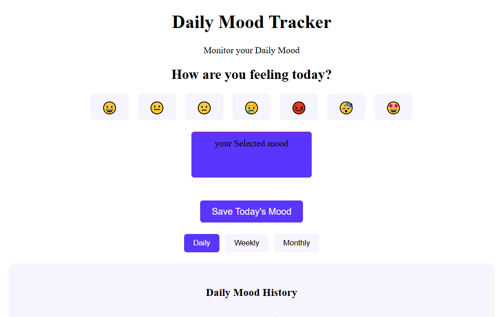
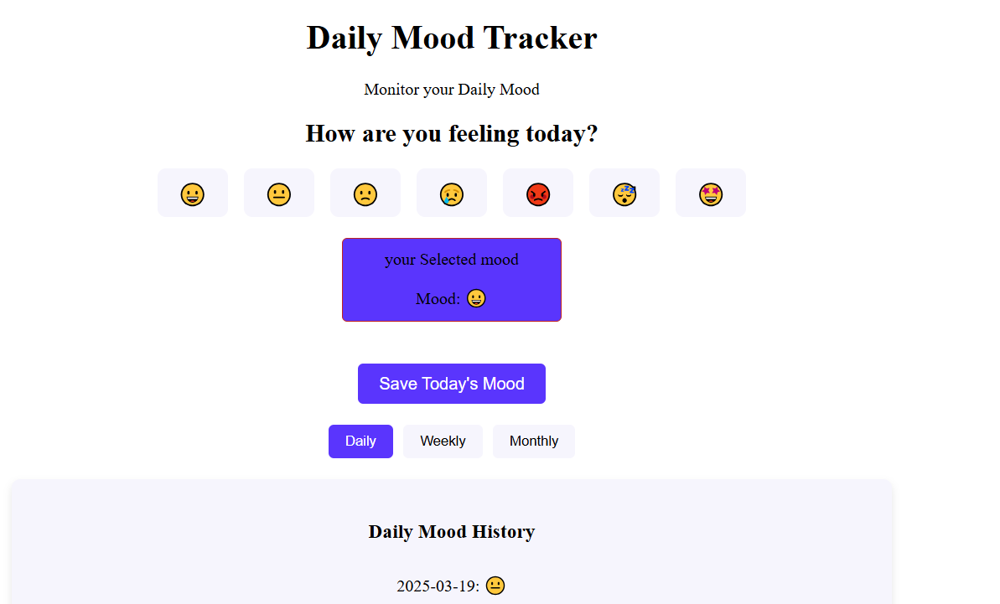
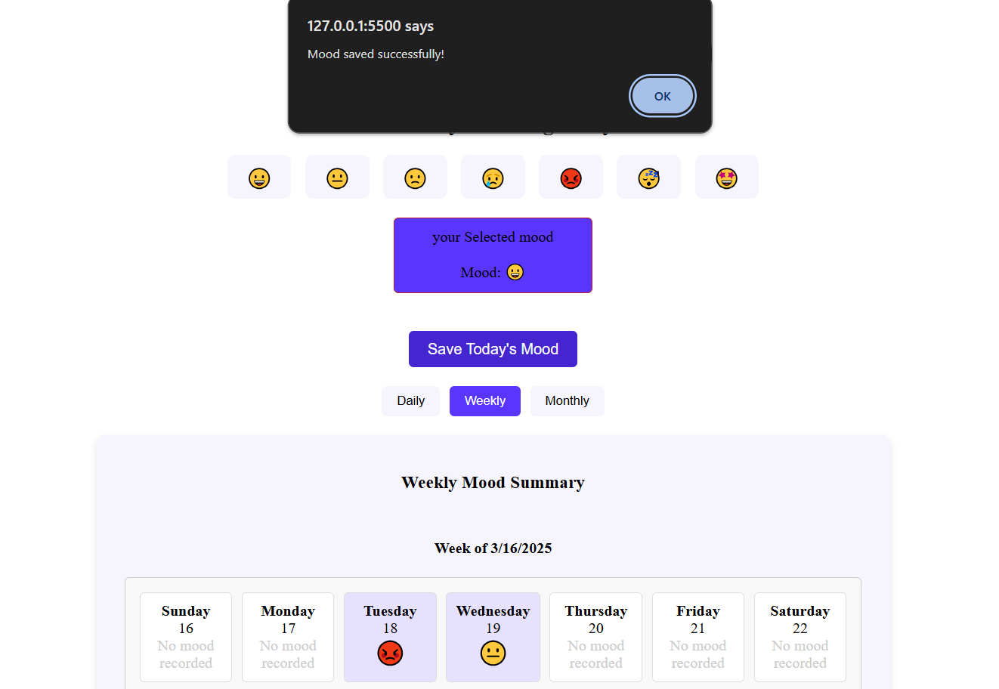
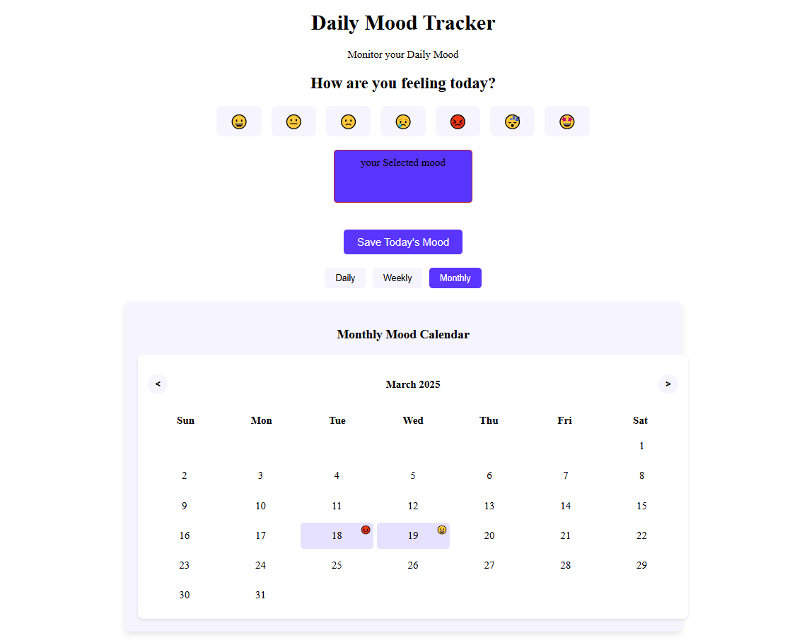

# Daily Mood Tracker [Try it live!](https://moodtrackerassg.netlify.app/)

## Features

- **Daily Mood Recording**: Choose from 7 different mood emojis to record how you're feeling
- **Multiple View Options**: See your mood history in daily, weekly, or monthly formats
- **Persistent Storage**: All mood data is saved in your browser's local storage
- **Interactive Calendar**: Monthly calendar view shows mood patterns at a glance

## Getting Started

### Prerequisites

- A modern web browser (Chrome, Firefox, Safari, Edge)
- No server required - runs entirely in the browser

### Installation

1. Clone or download this repository
2. Open the `index.html` file in your web browser
3. Start recording your daily moods!

## Usage

### Recording Your Mood

1. Select an emoji that represents your current mood:
   - 😀 Happy
   - 😐 Neutral
   - 🙁 Sad
   - 😢 Very Sad
   - 😡 Angry
   - 😴 Tired
   - 🤩 Excited
2. Click the "Save Today's Mood" button to record it

### Viewing Your Mood History



Toggle between three different views using the buttons:

- **Daily**: Shows a chronological list of all recorded moods


  
- **Weekly**: Displays the current week with a summary of each day's mood


  
- **Monthly**: Calendar view showing mood emojis for each day of the month



## Technical Overview

### File Structure

```
mood-tracker/
│
├── index.html         # Main HTML structure
├── style.css          # CSS styling
└── index.js           # JavaScript functionality
```

### Technologies Used

- **HTML5** for structure
- **CSS3** for styling
- **Vanilla JavaScript** for functionality
- **LocalStorage** for data persistence

### Data Structure

Mood data is stored in the browser's localStorage as a JSON array:

```javascript
[
  { date: "2025-03-15", mood: "😀" },
  { date: "2025-03-16", mood: "😐" },
  // ...more entries
]
```


## Future Enhancements

Potential improvements for future versions:

- Mood trend analysis and statistics
- Multiple mood tracking for a single day
- Notes associated with mood entries
- Data export/import functionality
- User accounts and cloud synchronization
- Dark/light theme toggle

## Contributing

Contributions are welcome! Feel free to submit a Pull Request.
